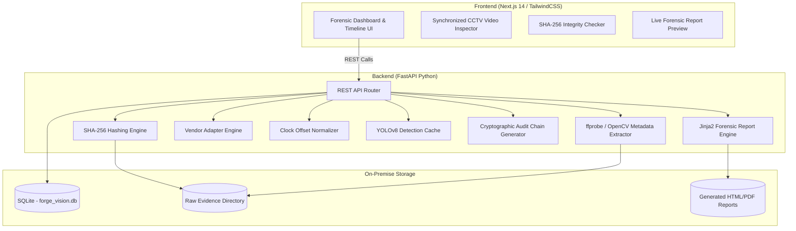

<div align="center">

# 🛡️ FORGE-VISION

### **Offline, Vendor-Agnostic Surveillance Video Evidence Preservation & Timeline Correlation Platform**


<p align="center">
  <b>Raw Video Evidence</b> ➔ <b>SHA-256 Preservation</b> ➔ <b>Clock Normalization</b> ➔ <b>Object Detection</b> ➔ <b>Audit Verification</b> ➔ <b>Forensic Report</b>
</p>

</div>

---

## 📌 Executive Summary

**FORGE-VISION** turns fragmented, vendor-mismatched, raw CCTV video surveillance footage into a single **immutable, timeline-normalized, court-reportable forensic case**.

In multi-camera surveillance investigations, cameras frequently suffer from **mismatched internal clocks** (e.g. CAM-01 is accurate, CAM-02 is +47s ahead, CAM-03 is −23s behind), fragmented file formats (Dahua, Hikvision, CP Plus), and strict evidentiary requirements where original files must **never be modified or corrupted**.

**FORGE-VISION** solves this by enforcing strict forensic principles:
1. **Immutable Ingestion**: Uploaded footage is immediately hashed via **SHA-256** and set to read-only.
2. **Clock Offset Normalization**: Mismatched camera clocks are aligned to a true incident timeline using linear offset arithmetic.
3. **Analytical Detection**: Object/person detections are indexed as separate metadata events referencing frame numbers without touching raw video.
4. **Cryptographic Audit Log**: Every action (upload, offset modification, re-verification) is appended to a **SHA-256 hash-chained audit log**.
5. **Instant Re-Verification**: Re-computes byte hashes on demand to detect file tampering or corruption instantly.
6. **One-Click Forensic Report**: Renders print-ready HTML/PDF reports detailing the complete chain of custody.

---

## 🏗️ System Architecture



---

## ⚡ Key Features

| Feature | Description | Implementation |
|---|---|---|
| **🔒 SHA-256 Evidence Hashing** | Computes 256-bit cryptographic digest upon intake in 64 KB chunks. | `services/hashing.py` |
| **🕒 Multi-Camera Timeline Normalization** | Aligns out-of-sync camera clocks into a unified incident time-scale. | `services/timeline.py` |
| **🛡️ Hash-Chained Audit Trail** | Every investigation step generates an entry linked via `entry_hash = SHA256(prev_hash \| timestamp \| action)`. | `services/audit.py` |
| **🔎 Tamper Detection Engine** | One-click integrity check re-evaluates file hashes against stored records, identifying byte modifications. | `routers/cases.py` (`POST /cases/{id}/verify`) |
| **🏷️ Vendor Adapter Dispatcher** | Rules-based specification matching for Dahua, Hikvision, and CP Plus format heuristics. | `adapters/` |
| **🎯 Object Detection Indexing** | Detects subjects and maps events to normalized timestamps without re-encoding video. | `services/detect.py` |
| **📄 One-Click Forensic Report** | Generates court-admissible HTML/PDF reports complete with evidence tables and audit chains. | `services/report_gen.py` |
| **🌐 100% Offline Capable** | Operates strictly on-premise without external cloud API dependencies. | Local FastAPI + SQLite |

---

## 📂 Project Structure

```
Forge-Vision/
├── backend/                  # FastAPI Python Backend
│   ├── main.py               # FastAPI App & Router Registration
│   ├── database.py           # SQLAlchemy Engine & Session
│   ├── models.py             # SQLite Schemas (Cases, Evidence, Events, AuditLog, Reports)
│   ├── routers/
│   │   ├── cases.py          # Case creation, verification, audit trail, reports
│   │   └── evidence.py       # Evidence ingestion, offset normalization, detections
│   ├── services/
│   │   ├── hashing.py        # Streaming SHA-256 Hashing Engine
│   │   ├── metadata.py       # Video Duration, Codec, Resolution & FPS Extractor
│   │   ├── timeline.py       # Clock Offset Math & Unified Timeline Generator
│   │   ├── detect.py         # YOLO Object Detection & Event Caching
│   │   ├── audit.py          # Cryptographic Hash Chain Logger
│   │   └── report_gen.py     # Jinja2 Forensic Report HTML/PDF Renderer
│   ├── adapters/             # Vendor Heuristic Adapters (Dahua, Hikvision, CP Plus)
│   ├── demo_assets/          # Synthetic CCTV Video Generator & Seed Script
│   └── requirements.txt      # Python Dependencies
│
└── frontend/                 # Next.js 14 App Router Frontend
    ├── app/
    │   ├── page.tsx          # Forensic Dashboard & Active Case List
    │   ├── cases/new/        # Open New Case File Form
    │   └── cases/[id]/       # Interactive Case Workspace (Timeline, Evidence, Audit, Report)
    ├── components/
    │   ├── Navbar.tsx        # System Navigation & Offline Status Indicator
    │   ├── TimelineViewer.tsx# Multi-Camera Horizontal Swimlane Timeline
    │   ├── VideoPlayer.tsx   # Synchronized CCTV Video Player with Timestamp Seek
    │   ├── IntegrityChecker.tsx # SHA-256 Verification & Tamper Alert Widget
    │   └── AuditLogViewer.tsx# Cryptographic Audit Chain Inspector
    └── lib/api.ts            # Typed API Client Wrapper
```

---

## 🚀 Quick Start Guide

### Prerequisites
- **Python**: `3.11` or `3.12`
- **Node.js**: `v20+` & `npm`
- **FFmpeg / ffprobe**: (Optional for hardware decoding; OpenCV fallback included)

---

### 1️⃣ Backend Setup

```bash
# Clone repository
git clone https://github.com/AdithyaKul/Forge-Vision.git
cd Forge-Vision

# Install Python requirements
pip install -r backend/requirements.txt

# Run Database Seed Script (Generates synthetic CCTV clips & pre-seeds Case #FV-2026-001)
python backend/demo_assets/seed.py

# Start FastAPI server
python -m uvicorn backend.main:app --reload --port 8000
```
> 📍 **API Documentation**: Open `http://localhost:8000/docs` in your browser.

---

### 2️⃣ Frontend Setup

```bash
# Navigate to frontend directory
cd frontend

# Install Node dependencies
npm install

# Start Next.js development server
npm run dev
```
> 📍 **Web Application**: Open `http://localhost:3000` in your browser.

---

## 🎬 Demo Scenario (#FV-2026-001)

### Incident: Warehouse Security Incident
- **True Incident Time**: `21:42:13`
- **Ingested Cameras**:
  - `CAM-01` (Main Gate) — *Dahua Spec* — Clock Drift: `+00:00s`
  - `CAM-02` (Storage Area) — *Hikvision Spec* — Clock Drift: `+00:47s`
  - `CAM-03` (Loading Bay) — *CP Plus Spec* — Clock Drift: `−00:23s`

### Interactive Walkthrough Script (~4 minutes)
1. **Dashboard**: View active cases and click on **Case #FV-2026-001**.
2. **Timeline Alignment**: Toggle between **Raw Timestamps** (scattered) and **Normalized Timestamps** (aligned around incident window).
3. **Frame Seek**: Click any event marker on the swimlanes to instantly jump playback to the exact frame.
4. **Integrity Check**: Click **"Re-Verify Integrity"** to run a live SHA-256 byte re-hash across all evidence files.
5. **Tamper Test**: Edit a byte in `backend/uploads/case_1_cam01.mp4` and re-verify to demonstrate the instant **FAIL / TAMPERED** red alert.
6. **Audit Trail**: Inspect the unbroken cryptographic hash chain linking every action.
7. **Report Generation**: Export a court-ready forensic report with one click.

---

## 📊 Data Schema Overview

```sql
-- cases: Investigation workspace records
CREATE TABLE cases (
    id INTEGER PRIMARY KEY AUTOINCREMENT,
    case_number VARCHAR UNIQUE NOT NULL,
    name VARCHAR NOT NULL,
    investigator VARCHAR NOT NULL,
    description TEXT,
    created_at DATETIME DEFAULT CURRENT_TIMESTAMP
);

-- evidence: File metadata and intake hashes
CREATE TABLE evidence (
    id INTEGER PRIMARY KEY AUTOINCREMENT,
    case_id INTEGER REFERENCES cases(id),
    filename VARCHAR NOT NULL,
    file_path VARCHAR NOT NULL,
    sha256 VARCHAR NOT NULL,
    duration FLOAT,
    codec VARCHAR,
    resolution VARCHAR,
    fps FLOAT,
    vendor_label VARCHAR,
    source_time VARCHAR,
    offset_seconds FLOAT DEFAULT 0.0,
    status VARCHAR DEFAULT 'ingested'
);

-- audit_log: Hash-chained audit trail
CREATE TABLE audit_log (
    id INTEGER PRIMARY KEY AUTOINCREMENT,
    case_id INTEGER REFERENCES cases(id),
    actor VARCHAR,
    action VARCHAR NOT NULL,
    detail TEXT,
    timestamp DATETIME DEFAULT CURRENT_TIMESTAMP,
    prev_hash VARCHAR NOT NULL,
    entry_hash VARCHAR NOT NULL
);
```

---

## 🤝 Roadmap & Future Enhancements

- [ ] **V2**: Native binary adapter support for proprietary Dahua `.dav` and Hikvision `.mp4` metadata streams.
- [ ] **V3**: Local LLM plain-language event summary generator.
- [ ] **V4**: GPU-accelerated YOLOv8 multi-camera person tracking.
- [ ] **V5**: Optional external blockchain integrity anchoring.

---

<div align="center">

**Built with precision for Forensic Science & Surveillance Video Integrity.**

[GitHub Repository](https://github.com/AdithyaKul/Forge-Vision) • [Report Bug](https://github.com/AdithyaKul/Forge-Vision/issues)

</div>
